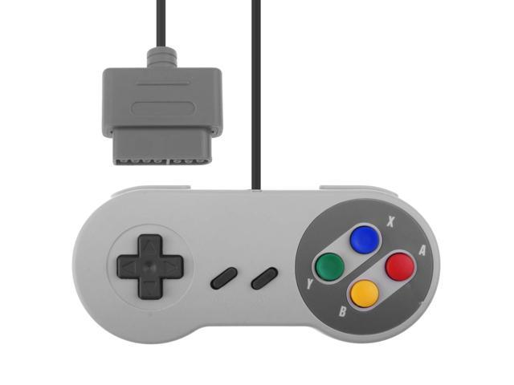
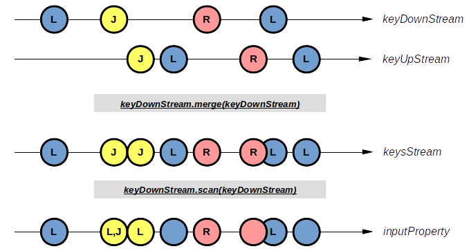
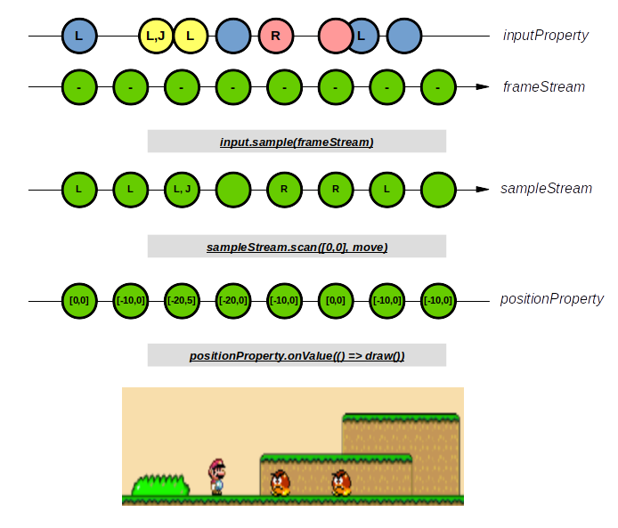

# Partie 5: Projet

## Functional Reactive Programming (FRP)
La programmation fonctionnelle réactive est une approche qui apporte une solution dans la manière de gérer les effets de bords.
En programmation réactive, tous les évènements correspondent à une suite de valeurs discrètes (Stream) auxquelles sont appliquées des traitements grâce à des éléments issus de la programmation fonctionnelle.

Selon Wikipedia:
> Functional reactive programming (FRP) is a programming paradigm for reactive programming (asynchronous dataflow programming) using the building blocks > of functional programming (e.g. map, reduce, filter). FRP has been used for programming graphical user interfaces (GUIs), robotics, games, and music, > aiming to simplify these problems by explicitly modeling time.[citation needed]

## BaconJS

Dans la cadre de ce projet, nous allons utiliser la librairie BaconJS qui est une implémentation de FRP en Javascript.

> A small functional reactive programming lib for JavaScript. Turns your event spaghetti into clean and declarative feng shui bacon, by switching from imperative to functional. It's like replacing nested for-loops with functional programming concepts like map and filter. Stop working on individual events and work with event-streams instead. Transform your data with map and filter. Combine your data with merge and combine. Then switch to the heavier weapons and wield flatMap and combineTemplate like a boss. It's the _ of Events. Too bad the symbol ~ is not allowed in Javascript.  https://baconjs.github.io/

Dans BaconJS, on retrouve deux constructions principales :
- L' EventStream, qui représente un ensemble de valeurs à travers le temps (touches clavier par exemple)
- La Property, qui représente une notion de valeur qui change au travers du temps (la position actuelle d'un objet par exemple)

Pour plus d'informations à ce sujet : https://medium.com/@fknussel/event-streams-vs-properties-e55b53be8f42

## Input as EventStream

Les entrées clavier (ou d'une manette de jeux) peuvent être considérées comme un ensemble de valeurs discrètes à travers le temps.

Le schéma ci-dessus présente deux EventStream, le `keyDownStream` qui représente les boutons qui onté été pressés, et le `keyUpStream` qui représente les boutons qui ont été relâchés.

Dès lors, il est possible de fusionner les deux streams d'évènements en un stream unique grâce à la fonction `merge()`est ainsi obtenir un `keysStream`.

Grâce à la fonction `scan()` (qui est en sorte de `reduce()`, mais qui fournit les valeurs intermédaires plutôt que la valeur finale), il est possible de calculer une valeur `inputProperty` qui correspond à l'état des entrées.

## Output as EventStream

Si les entrées peuvent être vu comme un Stream d'évènements, les sorties peuvent l'être également.

Créons maintenant un EventStream `frameStream` qui correspond au nombre d'images par seconde. Ce stream peut être utilisé pour échantiller `inputStream` grâce à la fonction `sample()` pour générer un `sampleStream`.
A partir de cet échantillon d'entrées, il est possible de calculer l'état final (grâce à une fonction pure) de notre application avec un `scan()`, afin de calculer la position du joueur et mettre cette valeur dans une `positionProperty`, il ne reste plus qu'à appeler une fonction impure `draw()` qui lors du changement de valeur dessine à l'écran.

Les diagrammes sous forme de marbles et très utilisé pour représenter les flux d'évènements. Si l'API et les concepts divergent quelque peu, il est possible de retrouver des schéma interactifs sur https://rxmarbles.com/#filter

## Partie 1

Prenez connaissance de la classe `main.js`, celle-ci contient trois fonctions :

- Le bootstrapping (main), en bas du fichier ou les streams sont initilisés
- Le fonction impure `draw()` qui va dessiner l'état courant à l'écran
- La fonction pure `computeStates()` qui va calculer les prochains états en fonction de l'état courant et de l'`inputStream`

Le but ici n'est pas ici que vous soyez capable de réécrire ce code mais que vous soyez capable de voir comment les concepts présentés ci-dessus peuvent être implémentées.

## Partie 2

Implé